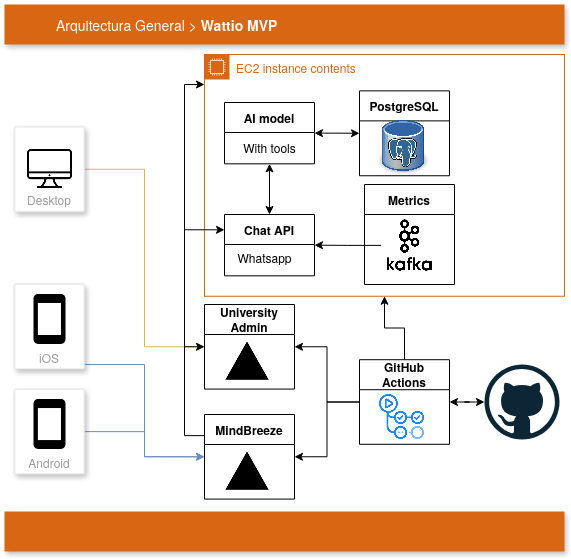
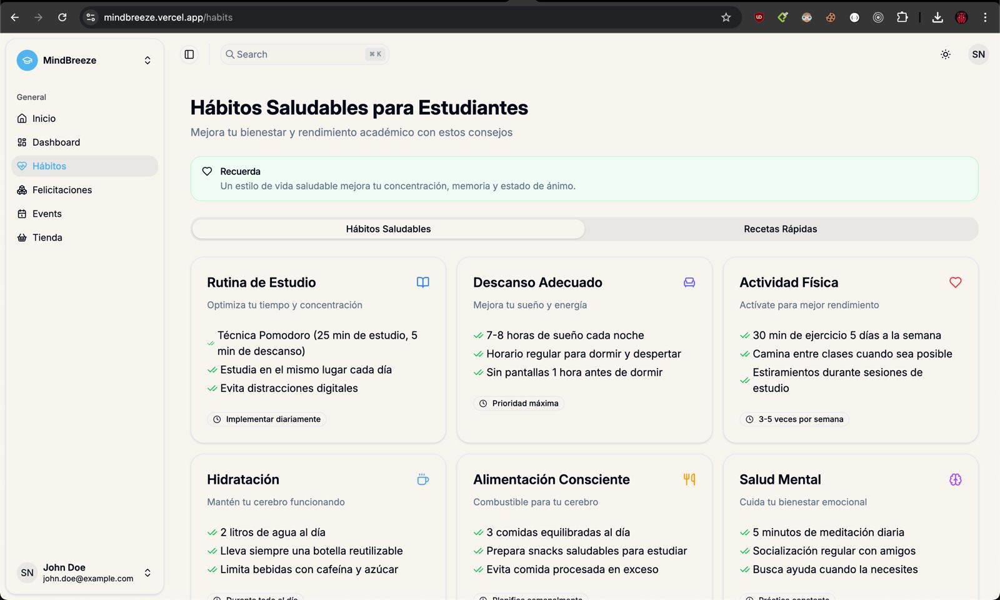
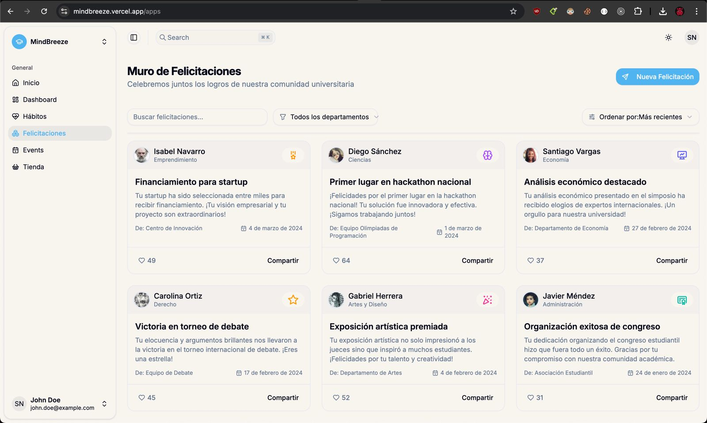
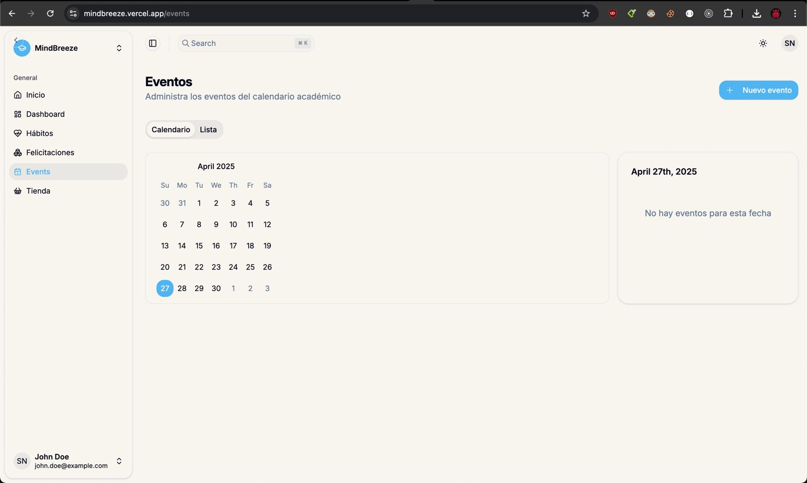

# Documentación técnica

## Resumen

MindBreeze es una solucón basada en LLMs, la cual detecta y previene altos niveles de estres
en los estudiiantes universitarios. Para ello, brinda un acompañamiento personalizado al estudiante.

## Stack Tenológico

*Presentación*
- **Framework/APIs**: React / Whatsapp API
- **Lenguajes**: JavasCript, TypesScript

*Backend*
- **Lenguajes**: Node.js
- **Frameworks**: Express.js
- **Arquitectura**: Basada en eventos

*Base de datos*
- **Motor**: PostgreSQL

*DevOps/ Infrastructura*
- **Hosting**: AWS
- **Contenedores**: Docker, Kubernetes
- **CI/CD**: Github Actions

*Otras Herramientas*
- **Control de versiones**: Git

## Pruebas y monitoreo
Los mensajes se guardan en un datalake para su posterior refinamiento y análisis. En el cual se usará
un modelo para clasificar mensajes y ver debilidades en las respuestas de a los usuarios. Para logs y 
métricas se usará kafka.

## Diagrama de arquitectura

## Prototipos

